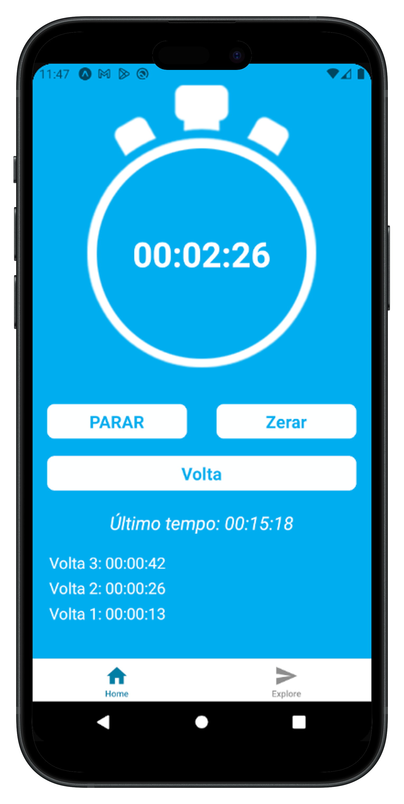

# ⏱️ App de Cronômetro com Voltas

<p align="center">
  
</p>

**Um cronômetro simples e funcional desenvolvido com React Native + Expo, com suporte a múltiplas voltas, controle preciso de tempo, e uma interface intuitiva!**

---

## 📱 Funcionalidades

- Iniciar, Pausar e Zerar o cronômetro
- Registrar múltiplas voltas com exibição sequencial
- Último tempo salvo após zerar
- Modal de confirmação para zerar voltas
- Controle inteligente do estado de bloqueio para evitar ações indesejadas

---

## 🛠️ Tecnologias utilizadas

- [React Native](https://reactnative.dev/)
- [Expo](https://expo.dev/)
- Hooks (`useState`, `useRef`)
- Componentes estilizados manualmente


---

## 📝 Commit principal

```bash
feat: Implementação do modal de confirmação para limpar voltas com sua estilização. Adicionamos o estado `bloquearCronometro` para impedir nova contagem com voltas da contagem anterior. Atualizações das funções `vai` e `limpar` para respeitarem a lógica de bloqueio. Atualizada a função `limparVoltas` para também fechar o modal e desbloquear o cronômetro. E implementamos renderização condicional dos botões 'Volta' e 'Limpar Voltas' para refletir o estado atual do cronômetro e das voltas.
```

---

## 🌍 English Version

**A simple and functional stopwatch built with React Native + Expo, featuring lap tracking, clean UI, and safe action confirmation!**

### 📱 Features

- Start, Pause, and Reset timer
- Lap registration with time history
- Shows last recorded time
- Confirmation modal before clearing laps
- Smart lock state to avoid unintentional actions

### 🛠️ Tech Stack

- React Native
- Expo
- Functional Components and Hooks

---

## 💡 Screenshot

```

```

---

## 📬 Contato

Desenvolvido com carinho por **Alex** 💙  
Contato: [alexjose68@hotmail.com]

---

> **“Feito na paz e no código.”**